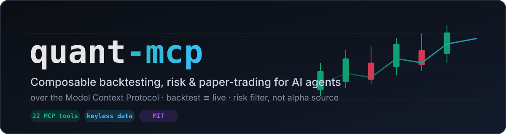
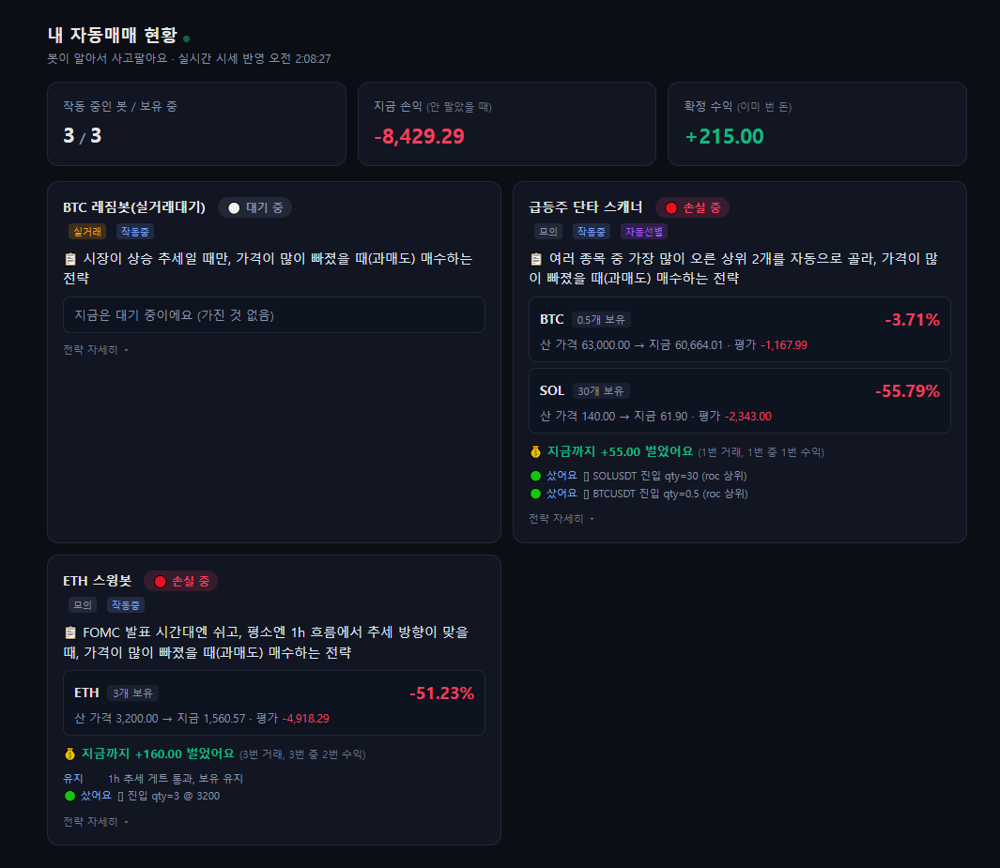

<div align="center">



**A composable backtesting, risk, and paper-trading engine for AI agents — over the Model Context Protocol.**

Let any MCP agent (Claude, Cursor, …) design a trading strategy as a validated JSON tree, backtest it with out-of-sample rigor, run it as a 24/7 paper bot, and watch it on a live dashboard — all from natural language.

[](https://github.com/Evanciel/evanciel-quant-mcp/actions/workflows/ci.yml)
[](LICENSE)
[](package.json)
[](https://modelcontextprotocol.io)
[](test)
[-orange.svg)](src/data/binance-public.ts)

**English** · [한국어](README.ko.md)

</div>

---

## In plain words

**You describe a trading idea in chat. quant-mcp lets the AI actually build it, stress-test it on real past prices, and run it as a practice bot — with no coding and no exchange keys.**

- 🗣️ **Say it** — *"Buy ETH when it dips during an uptrend, but stay out around FOMC announcements."*
- 🧪 **Test it** — it replays real Binance price history to see if the idea would have held up, and **warns you if the good result is probably just luck**.
- 🤖 **Run it** — deploy it as a 24/7 *paper* (fake-money) bot and watch a simple, plain-language dashboard.

It's deliberately honest: **it never promises profit.** Its real value is keeping you safe (risk controls) and telling you when a backtest is fooling you (overfitting filters). New to the jargon? Jump to the [Glossary](#glossary--no-finance-degree-needed).

## How it works (3 steps)

```
  Describe  ─►  Backtest  ─►  Run & watch
  (your words)  (real prices,   (paper bot +
                 honest check)   live dashboard)
```

1. **Describe** — your agent turns your words into a *validated strategy tree* (a small JSON spec it builds for you).
2. **Backtest** — it runs the strategy over real historical prices, then re-checks on data it never saw ("out-of-sample") so you aren't fooled by overfitting.
3. **Run & watch** — deploy a paper bot that trades on each new candle, and open a dashboard that explains everything in plain language.

The **same engine** powers all three steps: signal evaluation and position sizing are literally the same code in backtest and live. **Execution still differs** — live sends market orders on closed bars at real exchange prices, so slippage, partial fills, and fees won't match the simulation exactly.

---

## ⚠️ Honest positioning: a risk filter, not an alpha source

quant-mcp does **not** claim to find alpha. Deep research on this kind of retail infra concluded directional alpha ≈ 0 (243 out-of-sample optimizations → robust alpha of 0; overfitting confirmed). What it gives you that is *genuinely* valuable:

- 🛡️ **Risk control** — position sizing (EWMA vol-target / ATR / fractional Kelly), MDD circuit breakers, portfolio heat, exchange-resting stop/trailing math.
- 🔬 **False-discovery filtering** — Deflated / Probabilistic Sharpe (DSR/PSR), 70/30 hold-out OOS gating. *The factory rejects most candidates by design — that's correct, not a bug.*
- 🧩 **Expressiveness** — a composable strategy tree (indicators × regime × session × pairs × multi-timeframe × calendar events × screeners) with **one validated schema** and **backtest ≡ live signal parity** (the same pure functions decide signals and sizing in backtest, paper, and live — order *execution* differs: see above).

No tool advertises expected returns. Ever.

---

## Table of Contents

- [In plain words](#in-plain-words)
- [How it works](#how-it-works-3-steps)
- [Quick start](#quick-start)
- [What can an agent build?](#what-can-an-agent-build)
- [Tool reference (27 tools)](#tool-reference-25-tools)
- [Strategy expressiveness](#strategy-expressiveness)
- [Bots & live dashboard](#bots--live-dashboard)
- [Risk & execution layer](#risk--execution-layer)
- [Architecture](#architecture)
- [Roadmap](#roadmap)
- [Safety](#safety)
- [Glossary](#glossary--no-finance-degree-needed)
- [Contributing](#contributing)
- [License](#license)

---

## Quick start

quant-mcp is a stdio MCP server — **any MCP-compatible agent** (Claude Desktop, Claude Code, Cursor, Continue, …) can use its 27 tools. No API keys needed (data is Binance's public REST).

### From source (works today)

```bash
git clone https://github.com/Evanciel/evanciel-quant-mcp.git
cd evanciel-quant-mcp
npm install
npm test        # 308/308 — confirms the server boots + tools work
```

Register it with your MCP client (replace `ABSOLUTE_PATH`):

```json
{
  "mcpServers": {
    "quant-mcp": {
      "command": "npx",
      "args": ["-y", "tsx", "ABSOLUTE_PATH/evanciel-quant-mcp/src/mcp-server/index.ts"]
    }
  }
}
```

- **Claude Code (CLI):** `claude mcp add quant-mcp -- npx -y tsx ABSOLUTE_PATH/evanciel-quant-mcp/src/mcp-server/index.ts`
- **Claude Desktop:** `~/Library/Application Support/Claude/claude_desktop_config.json` (macOS) · `%APPDATA%\Claude\claude_desktop_config.json` (Windows)
- **Cursor:** `.cursor/mcp.json`

The server announces `quant-mcp server ready (stdio) — 27 tools` on stderr.

### Via npm (after publish)

```json
{ "mcpServers": { "quant-mcp": { "command": "npx", "args": ["-y", "quant-mcp"] } } }
```

> See [`examples/usage.md`](examples/usage.md) for ready-to-paste prompts and [`examples/mcp-config.json`](examples/mcp-config.json) for a full config.

---

## What can an agent build?

Talk to your agent in plain language — it assembles the strategy tree, validates it, backtests it, and (optionally) deploys a paper bot:

> *"Build an ETH strategy that only buys in an uptrend regime when RSI is oversold, but stays flat for 6 hours around FOMC. Backtest it on 1h data and tell me if it survives the out-of-sample gate. If it does, run it as a paper bot and open the dashboard."*

> *"Screen BTC, ETH, SOL, BNB for the top 2 by 1-hour momentum every morning at 9am KST, and momentum-trade them."*

> *"Suggest position sizes for a 3-coin basket using inverse-volatility weighting."*

All of the above is expressible **today**, backtested with OOS+DSR, and runnable as paper bots.

---

## Tool reference (27 tools)

Every tool maps 1:1 to a verified pure function and carries the *"risk filter, not alpha source"* disclaimer.

### 📊 Analysis & backtest (8)

| Tool | What it does |
|---|---|
| `validate_strategy` | Validate a composite strategy tree (recursion / weighted / time / scanner bounds). Upstream gate for everything. |
| `backtest` | Backtest + 70/30 hold-out OOS + PSR (overfit detection). |
| `backtest_short` | Short backtest (sell = open, buy = cover); same signal eval as long → backtest≡live. |
| `detect_regime` | ADX / Kaufman ER / ATR% → trend_up / trend_down / range / high_vol. |
| `derivatives_signal` | Funding (annualized) / OI quadrant / long-short tilt / taker flow (Binance fapi). |
| `suggest_position_size` | EWMA vol-target / ATR / fractional Kelly sizing. |
| `portfolio_risk` | Heat / MDD circuit breaker / correlation adjust (pure, no account). |
| `strategy_factory` | Bulk OOS + Deflated Sharpe survivor filter. Most candidates rejected by design. |

### 🔎 Screening, portfolio & events (3)

| Tool | What it does |
|---|---|
| `scan_universe` | Cross-sectional ranking of a symbol list by gapPct / roc / relVolume / rangePct → top N. |
| `allocate_portfolio` | Capital allocation across symbols: equal / inverse-vol (risk-parity diagonal) / vol-target. |
| `list_events` | Built-in scheduled-event calendars (FOMC) for `event` conditions. |

### 🤖 Strategies, bots & dashboard (7)

| Tool | What it does |
|---|---|
| `save_strategy` | Validate + persist a composite strategy (or a scanner) to the local store. |
| `create_bot` | Create a bot from a saved strategy (paper by default; `mode:live` trades live only after the key + master-switch gate, otherwise paper-fallback — pre-approved at creation, no per-order token). |
| `start_bot` / `stop_bot` | Run / stop a bot (evaluated every interval, reusing the backtest engine → backtest≡live). |
| `list_bots` / `get_bot_status` | List bots / inspect positions + recent fills + logs. |
| `open_dashboard` | Launch the local (127.0.0.1) real-time HTML dashboard. |

### 🔐 Live trading — bring-your-own-keys (9)

| Tool | What it does |
|---|---|
| `live_status` | Which broker / env (testnet/mock/live) is configured + master switch + hard limits (no key exposure). |
| `get_positions` / `get_balance` | Read your real exchange positions / balance (read-only, BYOK). |
| `place_order` | Real order — **fail-CLOSED 2-step confirmation token** + server-side hard limits (notional cap / symbol allowlist / daily-loss circuit). Mainnet requires `LIVE_TRADING_ENABLED=true`. |
| `place_protective` | Resting **OCO** (take-profit + stop-loss, one-cancels-the-other) on a spot long — same fail-closed 2-step token; server re-checks held quantity / direction / notional. Keeps the stop at the exchange even if the bot is down. |
| `get_protective` | Inspect the resting OCO for a symbol + sellable (free) balance — for cross-session restore / dedupe. Read-only, no key exposure. |
| `cancel_protective` | Cancel a resting OCO by `orderListId` (returned by `get_protective`), via `liveGate` + audit. |
| `get_open_orders` | Open (resting) orders for a symbol — leftover limit / orphan order check (read-only; Binance only for now). |
| `get_order_status` | Re-query an order by `orderId`/`clientOrderId` so agents can verify fills after placing (read-only). |

> **Default is paper.** Live trading is off unless you set keys *and* the master switch. Mainnet is gated behind testnet validation.

---

## Strategy expressiveness

A strategy is a **composable JSON tree**. Four node types:

| Node | Meaning |
|---|---|
| `leaf` | A rule-based strategy (indicator conditions → buy/sell). |
| `condition` | `IF <condition> THEN <node> ELSE <node>` — gate any sub-strategy. |
| `composite` | Combine children by `priority` or `weighted`. |
| `scanner` | Screen a universe → rank → pick top N → apply a sub-strategy (with optional wall-clock schedule). |

…and seven **condition types** (all backtest≡live):

| Condition | Expresses |
|---|---|
| `indicator` | 21 indicators (RSI, MACD, SMA/EMA, Bollinger, ADX, …) — add `timeframe` for **multi-timeframe** ("1h trend + 5m entry"). |
| `time` | month / quarter / dayOfWeek / **hour** / **minute** (with `tz`) — time-of-day strategies. |
| `regime` | Market regime ∈ {trend_up, trend_down, range, high_vol} — regime gating. |
| `anchor` | Price vs session anchor (dayOpen / prevClose / sessionHigh-Low / VWAP) × multiplier — gap-and-go / ORB. |
| `spread` | Pair vs another symbol: ratio / diffPct / z-score — pairs / stat-arb. |
| `event` | Within ±N hours of a scheduled event (**FOMC calendar** or inline `times` you supply — earnings, etc.). |
| `performance` | Recent returnPercent / drawdown / winRate gating. |

…plus rich **position management** on any strategy: `stopLoss`, `takeProfit`, **TP ladder** (partial take-profit), **scale-in** (averaging down), **pyramid** (adding to winners), **trailing stop**, and **short / futures** (testnet-validated).

<details>
<summary><b>Example tree</b> — uptrend-only RSI dip-buy, 1h-confirmed, avoids FOMC, with a TP ladder</summary>

```jsonc
{
  "id": "root", "type": "condition", "name": "Avoid FOMC",
  "condition": { "type": "event", "calendar": "FOMC", "hoursBefore": 6, "hoursAfter": 6 },
  "thenNode": { "id": "flat", "type": "leaf", "name": "stay flat", "strategy": { /* no-op */ } },
  "elseNode": {
    "id": "regime", "type": "condition", "name": "Uptrend only",
    "condition": { "type": "regime", "in": ["trend_up"] },
    "thenNode": {
      "id": "mtf", "type": "condition", "name": "1h trend filter",
      "condition": { "type": "indicator", "indicator": "sma", "params": { "period": 50 }, "operator": "gt", "value": 0, "timeframe": "1h" },
      "thenNode": { "id": "leaf", "type": "leaf", "name": "RSI dip", "strategy": {
        "symbol": "ETHUSDT",
        "rules": [{ "action": "buy", "conditions": [{ "indicator": "rsi", "params": { "period": 14 }, "operator": "lt", "value": 35 }], "quantityPercent": 100 }]
      } }
    }
  }
}
```
Deploy with `save_strategy({ tree, stopLossPercent: 5, tpLadder: [{pct:5,sellPct:50},{pct:10,sellPct:50},{pct:15,sellPct:100}] })`.

</details>

---

## Bots & live dashboard

`save_strategy` → `create_bot` → `start_bot` runs a bot that re-evaluates on each closed bar using the **same backtest engine** — so **signal & sizing decisions match the backtest**. *Execution* differs, though: live sends market orders at the close, so slippage, partial fills, and latency are **not** modeled (decisions match; fills do not). State lives in a local `node:sqlite` store — no account, no cloud.

`open_dashboard` serves a real-time HTML dashboard at `127.0.0.1` (one-time bootstrap token exchanged for an **HttpOnly session cookie** — the token never appears in the page or address bar after load; chart library self-hosted at `/vendor`, zero third-party scripts; Binance public WS for live unrealized PnL). It's built for **non-experts**: plain-language strategy summaries ("only buys in an uptrend when oversold"), 🟢 winning / 🔴 losing / ⚪ idle pills, realized vs unrealized PnL, and multi-symbol scanner positions — with a "details" toggle for the raw strategy DSL.

**Pro charting (TradingView-grade, no paid library):** built on `lightweight-charts` v5 — 1m–1M timeframes, **18 toggleable indicators with editable parameters** (Bollinger σ, Supertrend multiplier, MACD fast/slow/signal, Stochastic K/D, …), **separate oscillator panes**, on-chart **drawing tools** (trend lines / horizontal lines, persisted per bot in `localStorage`), the bot's own strategy indicators + entry/SL/TP markers, **live ticking** (crypto via Binance kline WS, KR stocks via polling), and **KST-unified time axis**.

**Manual trading & protective orders (BYOK, testnet-gated):** place market/limit **buy/sell** straight from a bot card, and set **take-profit / stop-loss by dragging lines on the chart** → a real Binance-spot **OCO** order (one-cancels-the-other: if TP fills, the SL auto-cancels, and vice-versa). These manual orders go through the *same* money-path as the bots — `liveGate` (testnet/mock only unless the master switch is on) → held-quantity & direction re-check on the server (client values are never trusted) → notional caps → audit log — and, on top of that, manual orders add a **two-step confirm token** (preview → confirm, hash-bound, single-use, 5-min TTL). (Autonomous bots have no per-order token; they're bounded by the gate, hard limits, and idempotency instead.) The dashboard is the *only* place these manual orders run, and they're **off by default** on mainnet.

**Exchange account sync (read-only):** each broker shows a **real-account panel** — actual exchange balance, real holdings, and any **resting OCO** orders (with a one-click cancel through the same safe path) — next to a **paper-vs-exchange drift badge** that quantifies how far your paper bots' ledger has diverged from real holdings. Keys are never returned to the browser; the panel polls `getAccount` every 60s and never places orders.

**Event alerts (Slack / Discord webhook):** an in-dashboard alert feed surfaces bot events in real time — entries, exits (with realized PnL), and **error/stopped** transitions — and can fan them out to a **Slack or Discord webhook**. The webhook URL is treated as a secret (stored masked, never echoed) and passes a strict **SSRF gate**: HTTPS-only, an exact Slack/Discord host allowlist, no IP literals / userinfo / non-443 ports, webhook-path shape checks, and `redirect: 'error'` — so it can never be coerced into hitting an internal address. Delivery is debounced per bot+event to avoid spam.

<div align="center">
  
  <br/>
  <sub>Plain-language live dashboard — strategy in human terms, win/loss pills, realized & unrealized PnL, multi-symbol scanner positions. (UI shown in Korean.)</sub>
</div>

---

## Risk & execution layer

- **Sizing & portfolio:** `suggest_position_size`, `portfolio_risk`, `allocate_portfolio` — vol-targeting, ATR, Kelly, heat, MDD circuit breakers, correlation adjustment.
- **False-discovery gates:** 70/30 hold-out OOS, PSR/DSR (deflated Sharpe), `strategy_factory`.
- **Execution core (key-free, tested):** exchange-resting stop / take-profit / trailing planning (`planProtectiveOrders`), position-drift reconciliation vs the exchange, balance-based sizing, and fill-status classification — so a stop is protected even if the bot process is down. (Live wiring is testnet-gated; see `docs/p0-execution-layer.md`.)
- **Manual protective orders (testnet-verified):** drag TP/SL on the chart → a real Binance-spot **OCO** so the exchange holds your stop *and* target as a linked pair, independent of any bot process. Routed through the same `liveGate` + held-quantity re-check + caps + two-step confirm-token pipeline; mainnet stays off until the master switch.

---

## Architecture

```
src/core/         portable, side-effect-free quant engine
  backtest/         indicators, engine, metrics, regime, deflated-sharpe, short-engine
  strategy/         spread-symbols, mtf (multi-timeframe)
  scanner/          rank (cross-sectional screening)
  calendar/         scheduled-event calendars (FOMC)
  position/         ladder (TP/scale-in/pyramid), short
  risk/             sizing, portfolio, allocation
  execution/        protective orders, reconcile (P0 — key-free)
  validation/       one Zod schema for the whole strategy tree
  types/            strategy types
src/data/         binance-public.ts — keyless Binance REST (klines pagination + fapi)
src/store/        node:sqlite local store (bots, strategies, trades, logs)
src/runner/       paper/live bot runner (reuses the backtest engine → backtest≡live)
src/dashboard/    127.0.0.1 real-time HTML dashboard
src/brokers/      multi-broker adapters (Binance + 한국투자/KIS + 키움) + safety gates
src/mcp-server/   stdio MCP server + 27 tools
```

**Design principle:** the live runner *reuses* `runCompositeBacktest`, so adding a condition type means editing exactly three files (types + validation + engine) and live inherits it — backtest ≡ live by construction.

---

## Roadmap

- ✅ Portable core + keyless Binance data
- ✅ MCP server + 27 tools (analysis, screening, portfolio, events, bots, live BYOK)
- ✅ Strategy expressiveness: indicator/time/regime/anchor/spread/MTF/event conditions + scanner nodes
- ✅ Position management: SL/TP, TP ladder, scale-in, pyramid, trailing, short/futures
- ✅ Paper bot runner + real-time dashboard
- ✅ P0 execution core (resting stops / reconcile / balance sizing) — key-free, tested
- ✅ Live money-path verified on Binance **testnet** (entry → resting SL/TP → cancel → close)
- ✅ Pro dashboard: TradingView-grade charts (18 indicators w/ editable params, multi-pane oscillators, drawing tools, live ticking, KST axis)
- ✅ Manual trading + drag-to-set TP/SL **OCO** protective orders — same two-step-token safety pipeline, testnet-verified
- ✅ Exchange account sync (read-only): real balance / holdings / resting OCO + paper-vs-exchange drift badge — keys never leave the host
- ✅ Event alerts: in-dashboard feed + Slack/Discord webhook with strict **SSRF gate** (HTTPS-only, host allowlist, no-redirect) + per-event debounce
- ✅ Mainnet pilot prep: GO/NO-GO pre-flight (`verify-mainnet-readiness.ts`) + [runbook](docs/mainnet-pilot-runbook.md) — withdrawal-OFF / IP / hard-limit checks, **zero orders**
- ⏳ Mainnet pilot (real funds — your decision; small-size, master switch) · limit orders · futures protective stops
- ⏳ Non-crypto data (equities/FX), order-book/microstructure, options

---

## Safety

- **Keyless by default** — analysis tools read only *public* market data; they never see your account and never trade.
- **Paper-first** — bots are paper unless you set exchange keys *and* the master switch (`LIVE_TRADING_ENABLED`).
- **Server-side hard limits** — notional cap, symbol allowlist, daily-loss circuit breaker (LLM cannot bypass).
- **2-step order confirmation (manual orders)** — `place_order` / `place_protective` are fail-closed: preview returns a token; execution requires the same args + token.
- **Autonomous bots vs manual orders** — a `mode:live` bot has **no per-order token**: it is pre-authorized once at `create_bot` and bounded by the master switch + hard limits + idempotency (the same single money-path). The per-order two-step token guards only the manual dashboard/MCP order tools.
- **Dashboard** — binds to `127.0.0.1` only; one-time bootstrap token → HttpOnly session cookie (token not exposed in page/URL afterwards), Host + Origin checks, chart library self-hosted (no third-party scripts), and **enabling live mode is a two-step preview→confirm** (turning it off stays one click).
- **Keys never via chat** — store keys with the CLI wizard (`npx quant-mcp setup`), the dashboard's ⚙️ settings form, or env vars. They live in `~/.quant-mcp/credentials.env` (chmod 600, gitignored), are shown masked only, and can't be read back. Never paste keys into the agent conversation.
- **Mainnet pre-flight** — before real-money trading, `npx tsx scripts/verify-mainnet-readiness.ts` runs a read-only GO/NO-GO check (env=live, master switch, key validity, **withdrawal permission OFF**, IP restriction, hard-limit self-test) — **places zero orders**. See the [mainnet pilot runbook](docs/mainnet-pilot-runbook.md).

### Adding exchange keys — *just add keys and trade*
Pick **live** in the wizard/dashboard and it flips the master switch + sets safe defaults (per-order cap, daily-loss circuit) for you — no fiddling with 5 env vars.
```bash
npx quant-mcp setup     # A) wizard: practice(testnet) / live → keys → "withdrawal off?" → done
```
**B)** Dashboard → **⚙️ API 키 설정** → enter keys, then **💸 실거래 모드** toggle (cap + withdrawal-off check). One-click emergency off → paper.
**C)** Env vars / secret managers (advanced; MCP-config `env` overrides the file). Even then, master-on with no cap falls back to a safe default. See [`SETUP-LIVE.md`](SETUP-LIVE.md).

See [`SETUP-LIVE.md`](SETUP-LIVE.md) before enabling live trading.

---

## Glossary — no finance degree needed

The tables above use some trading jargon. Here's what it all means, in plain words:

| Term | In plain words |
|---|---|
| **Backtest** | Replay a strategy over past prices to see how it *would* have done. |
| **Out-of-sample (OOS)** | Test on data the strategy never "saw" — the honest way to check it isn't just memorizing the past. |
| **Overfitting** | A strategy that looks amazing on past data only because it was tuned to that exact data — it falls apart live. |
| **Sharpe ratio** | Return per unit of risk. Higher = smoother gains. |
| **PSR / DSR** (Probabilistic / Deflated Sharpe) | Stats that estimate the chance a good-looking result was just luck. We use them to **reject false discoveries**. |
| **Regime** | The market's current "mood" — trending up, trending down, choppy/sideways, or wildly volatile. |
| **Position sizing** | *How much* to buy. Sizing by volatility / ATR / Kelly stops one bad trade from blowing you up. |
| **Vol-target · ATR · Kelly** | Three ways to set trade size based on how risky things are right now. |
| **Drawdown (MDD)** | How far you've fallen from your peak. A circuit breaker cuts risk when this gets big. |
| **Stop-loss · trailing stop** | Auto-sell orders that cap your loss (trailing = follows the price up to lock in gains). |
| **TP ladder · scale-in · pyramid** | Take profit in chunks · average down · add to winners — built-in position management. |
| **Pairs / spread / z-score** | Bet on the *gap* between two coins instead of their direction. |
| **Regime / anchor / MTF / event conditions** | Trade only in an uptrend · vs the day's open (gap plays) · confirm on a higher timeframe · avoid/trade around FOMC. |
| **Scanner** | Auto-pick the top N coins from a list (e.g. biggest movers) and trade them. |
| **Paper trading** | Practice mode with fake money — same logic, zero risk. |
| **Live / backtest parity** | The *decisions* (signals, sizing) are the same code in backtest and live. Fills are not identical: live uses real market orders, so slippage and fees differ from the simulation. |
| **MCP (Model Context Protocol)** | The open standard that lets AI agents (Claude, Cursor…) use external tools like this. |
| **BYOK** | "Bring your own keys" — you supply exchange API keys for real trading (off by default). |

---

## Contributing

Issues and PRs welcome. Conventions:

```bash
npm run typecheck   # tsc --noEmit (must be clean)
npm test            # vitest (308/308)
npm run build       # esbuild single-file bundle → dist/
```

New condition types follow the **3-file pattern** (`types/strategy.ts` + `validation/composite-node.ts` + `backtest/engine.ts`); the runner inherits them automatically. Keep core functions **pure** (no I/O) so backtest ≡ live holds.

---

## License

[MIT](LICENSE) © Evanciel

> The portable core was extracted from a parent project and verified by an adversarial multi-agent portability + correctness review. **Not financial advice — for research and education.**
